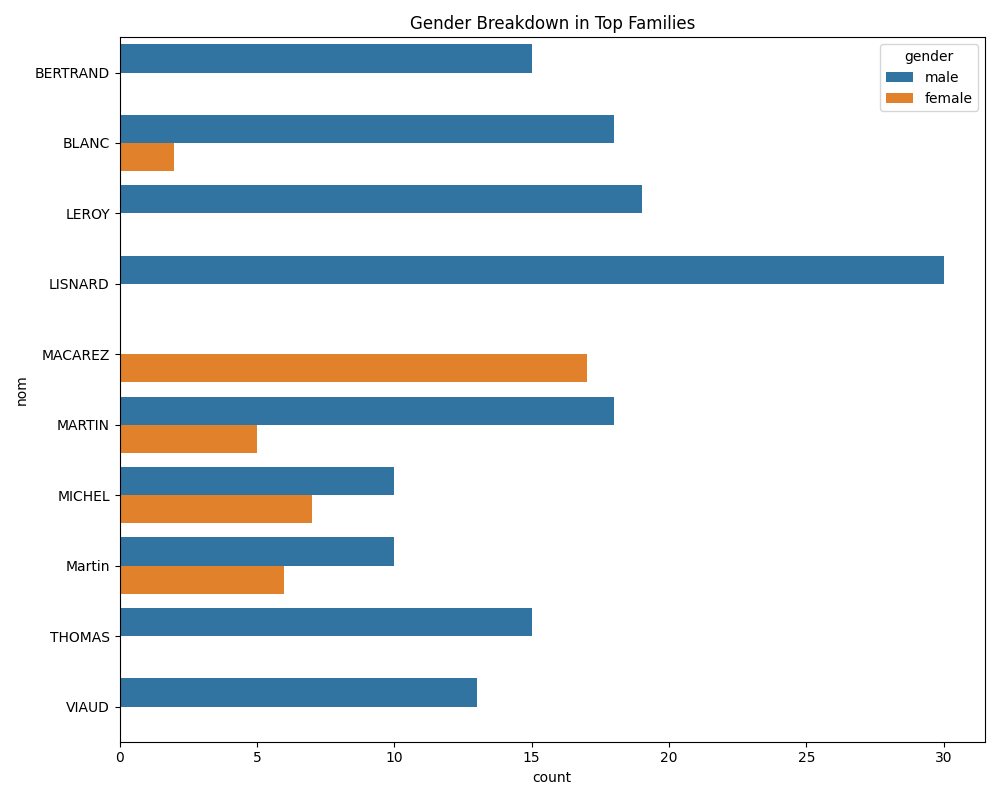

# Family Name Analysis

This analysis explores family names in the HATVP dataset.

## Declarations per Family Name

## People Statistics per Family Name

## Cumulated Wealth per Family Name

## Average Wealth per Person per Family Name

## Age Distribution of Top Families

## Gender Breakdown in Top Families

## Declarations vs Wealth

## Average Age vs Wealth per Family

All figures are generated by `family_name_analysis.py` and stored in the `family_name_analysis` directory when the script is executed.
