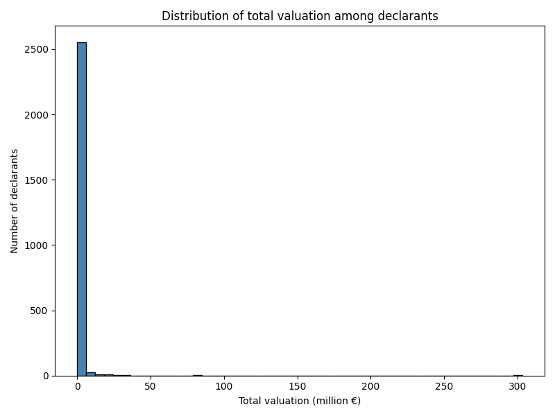
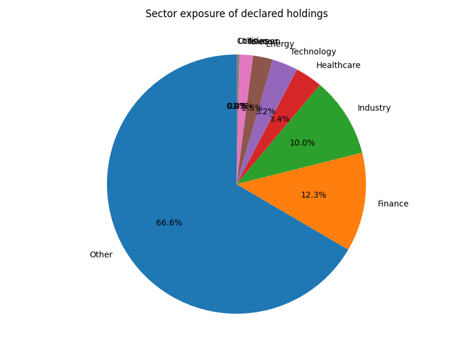
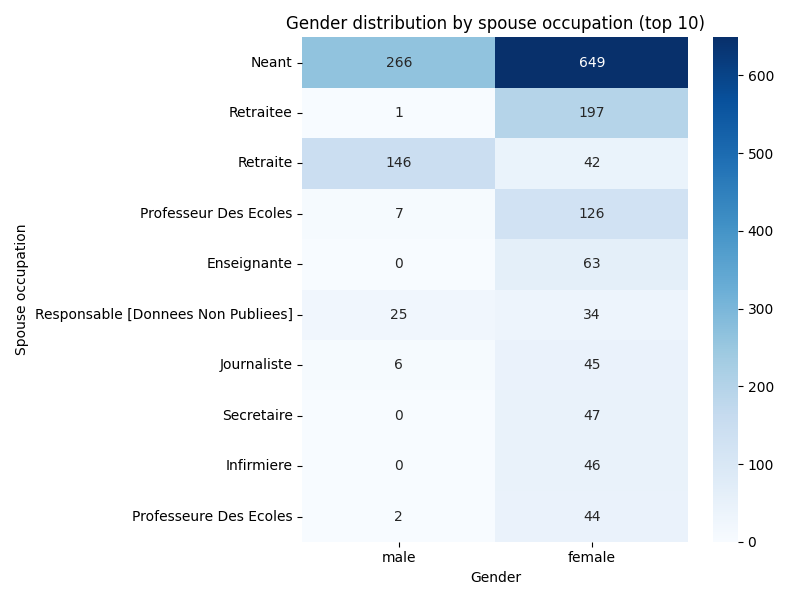

# 📊 MBA-Style Dossier  
## 🛡️ Risk Exposure of Declarants in the HATVP Database  
**Prepared for:** 📰 Journalists • 🌍 NGOs • 🕵️‍♂️ Compliance Officers • 📋 Investigative Units  

---

## 1️⃣ Executive Summary  

**📈 Scale of exposure**  
The HATVP dataset contains **2,607** distinct declarants with reported cumulative stock valuations exceeding **€2.05 billion** and a median individual valuation of **€12,192**.  
Concentrated holdings in major listed firms — *Crédit Agricole* alone appears in **214** declarations — signal potential sectoral capture, particularly in **finance**, **energy**, and **telecommunications**.

**⚠️ Key Risk Typologies**

| 💼 Risk Type | 📌 Indicators | 📊 Exposure |
|--------------|--------------|-------------|
| 💰 Financial | Large/unexplained holdings; extreme outliers (e.g., €303 M stake) | 🔴 High for outliers / 🟠 Medium overall |
| 📰 Reputational | Media scrutiny of prominent firms, controversies | 🟠 Medium–🔴 High |
| ⚖️ Ethical / Conflict of Interest | Equity ties to regulated sectors | 🔴 High |
| 🏛️ Operational / Political | Investigations, sanctions risk | 🟠 Medium |

**🔥 Heatmap Summary**

| 👤 Type of Official | 💰 Financial | 📰 Reputational | ⚖️ Ethical | 🏛️ Operational |
|--------------------|-------------|----------------|-----------|----------------|
| 🏛️ National-level | 🔴 High | 🔴 High | 🔴 High | 🔴 High |
| 🏘️ Local officials | 🟠 Medium | 🟠 Medium | 🟠 Medium | 🟠 Medium |
| 🗂️ Senior civil servants | 🟠 Medium | 🟠 Medium | 🟠 Medium | 🟠 Medium |
| 👫 Spouse/household | 🟢 Low | 🟠 Medium | 🟠 Medium | 🟢 Low |

**📌 Headline Risks**
- 📍 **Strategic sector concentration** → high conflict-of-interest potential.  
- 🕵️‍♂️ **Opaque spouse data** → “Neant” 266× (male) & 649× (female).  
- 🌐 **Cross-border holdings** → Microsoft, Linde, Amazon → foreign influence & FX risk.  
- 💎 **Extreme outliers** → Philippe Briand (€303 M).  

---

## 2️⃣ Introduction & Methodology  

### 2.1 📜 Legal Framework
- French law **n°2013-907** → mandatory asset disclosure.  
- HATVP verifies, publishes, sanctions.  
- EU directives (AML, Whistleblower) shape compliance.

### 2.2 📂 Data Sources
- `person_stock_report.csv` → equity valuations  
- `normalized_stocks.csv` → cleaned company names  
- `indexes/*.csv` → CAC40, SBF120, S&P500 mappings  
- `spouse_occupation_gender_counts.csv` → declared spouse jobs

### 2.3 📐 Risk Assessment Method
- Based on **COSO**, **OECD Anti-Corruption Guidelines**, **Transparency International CPI**.  
- Risk scoring matrix across **financial**, **reputational**, **ethical**, **operational**.

---

## 3️⃣ Macroeconomic & Regulatory Context  

### 3.1 ⚖️ Regulations
- 🇫🇷 **Law Sapin II (2016)** → anti-corruption, risk mapping.  
- 🇪🇺 **5th/6th AMLD** → due diligence, ownership transparency.  
- 📅 **Upcoming** → EU Anti-Corruption Directive 2023.

### 3.2 📰 Past Controversies
- 2014 — Thomas Thévenoud: tax irregularities.  
- 2017 — François Fillon: fictitious jobs scandal.  
- 2018 — Alexandre Benalla: secondary income questions.

---

## 4️⃣ Risk Typology & Assessment  

### 💰 Financial Risk  
- Outliers: Philippe Briand (€303 M), Roger Pellenc (€84 M).  
- High inequality in asset distribution.  

### 📰 Reputational Risk  
- Sensitive firms: Crédit Agricole, Engie, Orange, Sanofi.  
- Risk of perceived bias in policymaking.

### ⚖️ Ethical / Conflict of Interest  
- Ministers owning stocks in sectors they regulate.  
- Ambiguous spousal occupations.

### 🏛️ Operational / Political Risk  
- Possible parliamentary inquiries, suspensions, legal action.

---

## 5️⃣ Data-Driven Analysis  

### 5.1 📊 Asset Distribution
- Total: **€2.05 B**  
- Median: **€12,192**  
- Mean: **€786,771**  
- Max: **€303 M**  

### 5.2 🏦 Sector Analysis  
**Top CAC40/SBF120 Holdings**: Crédit Agricole (214), Air Liquide (136), Orange (128), Engie (125), Axa (95)  
**Top S&P500 Holdings**: Microsoft (11), Kraft Heinz (5), Linde (4)  

### 5.3 🔍 Policy Influence Links  
- Finance Committee ↔ bank stocks.  
- Energy Ministers ↔ utilities stocks.

### 5.4 👫 Spousal Occupations  
- “Neant” most common → 915 total unspecified.  
- Large data gap limits indirect risk assessment.  

---

## 6️⃣ High-Risk Profiles & Case Studies  

**A. Municipal Leader (€303 M)** → Financial, Ethical, Reputational risk.  
**B. Energy Sector Overlap** → Conflict in municipal contracts.  
**C. International Tech Exposure** → Data sovereignty & bias risks.  
**D. Opaque Spouse Role** → Hidden lobbying/consultancy.

---

## 7️⃣ Risk Mitigation & Governance  

- 📑 **More granular disclosures** (sector tags, spouse employer).  
- 📅 **Annual updates** instead of mandate start/end only.  
- 🎓 **Conflict-of-interest training**.  

**🌍 Comparative Best Practices**  
- 🇺🇸 Blind trusts (Cabinet)  
- 🇬🇧 Monthly registers (spousal interests)  
- 🇨🇦 Ethics Commissioner audits  

---

## 8️⃣ Appendices  

**Key Metrics**
| Metric | Value | Source |
|--------|-------|--------|
| Declarants | 2,607 | `person_stock_report.csv` |
| Total Equity Valuation | €2,051,113,142 | idem |
| Median Valuation | €12,192 | idem |
| Top CAC40 Holdings | Crédit Agricole (214), Air Liquide (136), … | CAC40/SBF120 |
| Top S&P500 Holdings | Microsoft (11), Kraft Heinz (5) | S&P500 |
| Most frequent spouse occupation | “Neant” (915 total) | spouse_occupation_gender_counts.csv |

---

## 📚 References  
- 🇫🇷 Law n°2013-907 (Transparency of Public Life)  
- 🇫🇷 Law n°2016-1691 “Sapin II”  
- OECD (2017) *Preventing Policy Capture*  
- Transparency International (2023) *Corruption Perceptions Index*  

---
